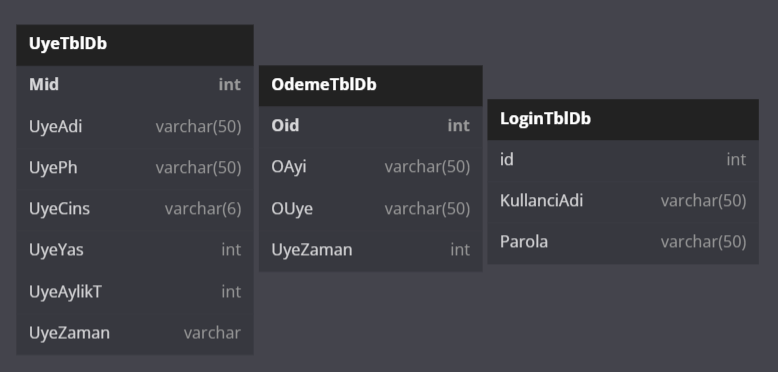

# Spor Salonu Yönetim Sistemi
# Açıklama 
>Bu proje spor salonlarını yönetmek için bir program olacaktır.  Bu sayede spor salonunda bizi ilgilendiren tüm abonelerin bilgilerini kaydedebiliriz.
# Kullanım Amacı
>Bu program spor salonu yöneticileri için tasarlanmıştır.  Yöneticilerin her biri bu programda kendi hesabını oluşturabilir ve özelliklerini kendi spor salonları için kullanmaya başlayabilir.

>>Bu programda tüm katılımcıların bilgileri kayıt altına alınabilmekte olup, ödeme bilgileri ve eğitim saatlerinin yanı sıra değiştirilebileceği veya silinebileceği bir sayfa bulunmaktadır.
## Database Scheme

